# Math History Visualization · 从历史长河中重学数学

> "教育不是灌输，而是点燃火焰。" —— 苏格拉底
>
> "我们的应试教育最大的失败，不是学生记不住公式，而是从不告诉他们：这个公式是哪个孤独的灵魂、在哪个动荡的世纪、为了回答什么真实的问题，呕心沥血几十年才写下的。"

一个用 **Python + PyTorch + Matplotlib/Manim** 来"重走数学发现之路"的可视化项目。
不是再背一遍公式，而是**沿着历史的脚印**，亲手推导一次：从古巴比伦的泥板，到牛顿写下 $\dot{x}$，到伽罗瓦决斗前夜的手稿，到工业革命蒸汽机背后的傅里叶级数。

---

## 🎯 项目动机：为什么我们学了 12 年数学却讨厌数学？

中学数学老师最常见的一句话是：
> "你以后买菜会用求根公式吗？"

这是数学教育最惨烈的一次自我背叛。它把**人类两千年最壮丽的智识冒险**，矮化成了"加减乘除买菜论"。

真实的数学史不是这样的：

- **二次方程**的求根公式刻在公元前 1800 年的巴比伦泥板上 —— 那是为了**分配土地**和**计算粮仓**。
- **三次方程**的解法引发了 16 世纪意大利数学家之间的**公开决斗**（Cardano vs Tartaglia），赌注是名誉和饭碗。
- **五次方程没有根式解** —— 这个结论让 20 岁的阿贝尔贫病而死，让 21 岁的伽罗瓦在决斗前夜写下了**群论**，开启了整个现代代数。
- **微积分**不是牛顿一个人在苹果树下发明的 —— 它是**两千年的接力赛**：阿基米德的穷竭法、印度喀拉拉学派的级数、开普勒算酒桶体积、费马求切线、巴罗（牛顿的老师）证出微积分基本定理的几何雏形……牛顿和莱布尼茨只是在 1666 年前后**同时收尾**，接着两人为了优先权**互相指控剽窃了三十年**，把英国数学和欧陆数学撕裂了一个世纪。
- **傅里叶级数**诞生于 1807 年，是为了解决**蒸汽机金属部件的热传导**问题 —— 直接服务于工业革命。
- **矩阵和线性代数**也是**跨越两千年的合作**：中国《九章算术》在公元前就用消元法解五元一次方程组（比高斯早 1500 年），日本关孝和（1683）比莱布尼茨更早写下行列式，高斯为了**找回失踪的小行星谷神星**发明了最小二乘法，凯莱和西尔维斯特在 1850 年代才把"矩阵"作为一种代数对象正式命名 —— 而这一切，最后成了量子力学、Google PageRank 和深度学习的共同语言。

马斯克在清华的演讲里说过类似的话：物理教育的失败，是没有教学生**第一性原理**和**真实世界的物理意义**，只让他们背公式应付考试。数学也一样。

**这个项目的目标**：用代码和动画，把数学还原成它本来的样子 —— 一部**带血带肉的人类思想史**。

---

## 🗺️ 学习路线图（按历史时间线）

```
前 1800 ── 前 250 ── 263 ── 1545 ── 1666 ── 1801 ── 1807 ── 1832 ── 1858 ── 1925 ── 现代
   │         │       │      │       │       │       │       │       │       │       │
 巴比伦   阿基米德  刘徽   卡尔达诺 牛顿/   高斯    傅里叶  伽罗瓦  凯莱   海森堡  PyTorch
 二次方程  穷竭法  九章   三次决斗 莱布尼兹 找回    热方程  群论    矩阵   矩阵    自动微分
           圆周率  算术            微积分   谷神星   工业革命 五次无解 代数   力学    深度学习
```

> 灰色的横线背后，是**七十多代人**接力奔跑的两千年。本项目的目的，就是把这条河的每一个弯都走一遍。

### Chapter 0 · 视角即解法：为什么"换个角度看，难题瞬间消失"

> "数学家不解决问题，他们改写问题。" —— 笛卡尔式的精神

1787 年，9 岁的高斯被老师罚算 $1+2+\cdots+100$。他几秒钟交卷：5050。
他不是算得快，而是**看到了别人看不到的对称性**：

```
  1 +   2 +   3 + ... +  98 +  99 + 100
100 +  99 +  98 + ... +   3 +   2 +   1
─────────────────────────────────────────
101 + 101 + 101 + ... + 101 + 101 + 101    =  100 × 101 = 10100,  ÷2 = 5050
```

这不是"小聪明"，而是**视角的革命** —— 他把"加法"看成了"配对的对称"。
**几乎所有被罗列在教辅书上的"解题技巧"，本质上都是同一件事：换一个表征，让原来藏起来的结构暴露出来。** 难和易的差异，不在题目本身，而在**你戴的那副结构眼镜**。

#### 0.1 历史上反复出现的"换视角"母题

| 技巧 | 它在偷偷利用的结构 | 历史源头 | 现代化身 |
|------|------------------|---------|---------|
| **配对求和**（高斯 1787） | 对称群 $\mathbb{Z}/2$ 的作用 | 巴比伦泥板已用 | 闭式数列、生成函数 |
| **消元法**（《九章算术》前 200） | 线性方程组的行空间 | 刘徽注、高斯 1810 | LU 分解、Gauss–Jordan |
| **裂项相消**（莱布尼茨 1672） | 离散版"微积分基本定理"  $\sum (a_{n+1}-a_n) = a_N - a_0$ | 数列差分演算 | Stokes 定理、上同调 |
| **合并同类项** | 商环 / 等价类 | 花拉子米 *al-Jabr* (820) | 群环、张量收缩 |
| **配方法**（巴比伦 前 1800） | 二次型的正交对角化 | 巴比伦泥板 BM 13901 | 主成分分析、SDP |
| **换元法**（费马 1630s、欧拉 1750s） | 坐标变换 / 流形局部图 | 笛卡尔解析几何 | 微分同胚、归一化流 |
| **构造辅助线**（欧几里得 前 300） | 把不可见的对称显式化 | 《几何原本》 | 范畴论的伴随函子 |
| **数学归纳法**（帕斯卡 1654） | 自然数良序原理 | 欧几里得已有实质用法 | 递归、不动点定理 |
| **生成函数**（欧拉 1740） | 把序列编码成解析函数 | 《无穷分析引论》 | $z$ 变换、母函数法 |
| **对偶变换**（庞色列 1822） | 点 ↔ 线的射影对称 | 射影几何 | 凸优化对偶、傅里叶变换 |
| **不变量法**（克莱因 1872） | 群作用下的不变量 | 埃尔朗根纲领 | 李群、规范场论 |

#### 0.2 为什么是高斯"一下知道"？—— 直觉是历史的浓缩

把"高斯一下看出 $1+\cdots+n=\frac{n(n+1)}{2}$"归功于天赋，是教育学上最便宜的偷懒。事实是：

1. **对称即简化**这条母题，从巴比伦人切土地、毕达哥拉斯排石子（"三角形数"）开始，就在数学传统中流淌。高斯只是**继承了这条直觉**。
2. 教辅书把这些技巧**罗列**成几十个独立的招式，掩盖了它们其实都是同一件事的不同投影。学生背招式 → 永远只是"做过的题会、没做过的不会"；看清结构 → "没见过的题也能换个角度试试看"。
3. 这条直觉**可以被训练**：每当你遇到一个能"换视角变简单"的瞬间，就在脑里给它打上标签 —— **是哪种对称？哪种不变量？哪种同构？** 几年下来，你也会"一下看出"。

> 一句话总结：**所有"灵感"的背后，都是某种对称性、不变性、或同构。**

#### 0.3 可视化与代码

- **可视化**：
  - 高斯配对求和的"两端向中间收拢"动画
  - 《九章算术》原文 → 矩阵行变换的同步动画
  - 裂项 $\sum \frac{1}{n(n+1)} = \sum(\frac{1}{n}-\frac{1}{n+1})$ 与连续版 $\int f' = f(b)-f(a)$ 并排呈现
  - 高斯积分 $\int_{-\infty}^{\infty} e^{-x^2} dx = \sqrt{\pi}$ 的极坐标换元几何
  - 欧几里得"三角形内角和 = 180°"的辅助线 = 借来的平移对称
  - 射影对偶：点动 ⇔ 线动 的同步动画
- **代码**：`ch00_perspectives/`
  - `gauss_pairing_sum.py` —— 配对求和的对称动画 + 用 `torch` 验证 $n$ 到 $10^6$
  - `jiuzhang_elimination_anim.py` —— 方程章"遍乘直除"与现代矩阵消元同步演示
  - `telescoping_as_calculus.py` —— 离散裂项 vs 连续基本定理
  - `gaussian_integral_polar.py` —— 极坐标换元算 $\sqrt{\pi}$
  - `generating_function_fib.py` —— 用 $\frac{x}{1-x-x^2}$ 一行解出斐波那契通项（SymPy）
  - `auxiliary_line_euclid.py` —— 欧几里得辅助线 = 隐藏的平移
  - `duality_point_line.py` —— 射影对偶的实时联动

> **教育学意义**：本章是贯穿全书的元章节。读完后，每学一个新概念都自动问一句：
> "**这背后是哪种对称、哪种不变量？**" —— 这是数学家和做题家的真正分水岭。

### Chapter 0.5 · 公式即直觉的化石：为什么数学反复出现平方、$1/r^2$、$\log$

> "数学家偷懒的方式，是同一个直觉用一辈子。"

为什么方差是 $\mathbb{E}[(X-\mu)^2]$ 而不是 $\mathbb{E}|X-\mu|$？为什么万有引力是 $1/r^2$ 而不是 $1/r$ 或 $1/r^3$？为什么信息量、熵、似然估计、声音响度、地震烈度，全都拿 $\log$ 来度量？

这些不是巧合，也不是数学家的审美偏好 —— 它们是**几何 / 物理 / 概率三条河流在同一个河床上汇流**留下的痕迹。看穿这些**反复出现的母题**，就拿到了"读公式"的钥匙：当你看到一个新公式里出现 $(\cdot)^2$、$1/r^2$、$\log(\cdot)$、$e^{(\cdot)}$，应该立刻问 —— **它在偷偷利用哪个空间结构？哪个守恒律？哪种同构？**

#### 0.5.1 为什么是平方？—— 几何、能量、概率三处汇流

平方（$x^2$）几乎是数学里最频繁出现的算子，它**同时**承担了至少五种角色：

| 出现场所 | 表达式 | 平方的真正含义 |
|---------|-------|---------------|
| 勾股定理（前 1800，巴比伦泥板） | $a^2 + b^2 = c^2$ | 欧氏度量：把两个**正交**方向上的长度合成 |
| 动能（莱布尼茨 1686，*vis viva*） | $E = \tfrac{1}{2}mv^2$ | 守恒量必须是速度的偶函数（向左 = 向右） |
| 方差（高斯 1809） | $\mathrm{Var} = \mathbb{E}[(X-\mu)^2]$ | $L^2$ 范数 → 唯一可微 + 满足勾股分解 |
| 最小二乘（高斯 1801，找谷神星） | $\min \sum (y_i - \hat{y}_i)^2$ | 误差在残差空间的正交投影 |
| 量子振幅（玻恩 1926） | $P = \|\psi\|^2$ | 概率守恒要求 $L^2$ 归一化 |

为什么不用绝对值 $|x|$？事实上拉普拉斯 1774 年（更早还有博斯科维奇 1755）真的试过"最小绝对偏差法"，比高斯的最小二乘早 30 年。结果是 —— $|x|$ 在零点不可导，没有解析解；而 $x^2$ 求导后线性、有闭式解、让正交投影定理成立。**数学不是选了"最好"的度量，是选了"能算"的度量** —— 然后整个分析学（希尔伯特空间、傅里叶、量子力学、PCA、深度学习的 MSE 损失）都建立在这个偶然便利之上。

> 一句话：**$x^2$ = "正交分解 + 可微"的双通行证。**

#### 0.5.2 为什么是 $1/r^2$？—— 三维空间的几何必然

牛顿万有引力 $F \propto 1/r^2$、库仑定律、点光源照度、声波强度衰减 —— 全是 $1/r^2$。这不是物理巧合，而是**三维空间几何的直接后果**：

```
半径为 r 的球面面积 = 4πr²
点源发出的总通量守恒 → 单位面积上的通量 ∝ 1/r²
```

这是**高斯散度定理**的直观版本（高斯 1813、格林 1828、奥斯特罗格拉茨基 1839）。所以：

| 维度 | 几何 | 力的衰减 | 后果 |
|------|------|---------|------|
| 1D（弦上的波） | "球面" = 两个点 | 不衰减 | 信号无损传播 |
| 2D（水面涟漪） | 圆周长 $\propto r$ | $\propto 1/r$（强度 $\propto 1/r$） | 没有稳定有界轨道 |
| **3D（我们的世界）** | 球面 $\propto r^2$ | $\propto 1/r^2$ | 行星轨道稳定 |
| 4D 以上 | 超球面 $\propto r^{n-1}$ | $\propto 1/r^{n-1}$ | 任何微扰都让原子坍缩 |

埃伦费斯特 1917 年用纯维度论证证明：**稳定的束缚态轨道（行星、原子）只存在于 3 维空间**。如果指数偏离 2 哪怕一点，太阳系或氢原子在第一次扰动里就瓦解了。

> 一句话：**$1/r^2$ 是三维空间向你展示它的维度。**

#### 0.5.3 为什么是 $\log$？—— 把乘法变成加法的字典

$\log$ 在数学中无处不在，但它做的其实只有一件事：**把乘法关系压扁成加法关系**。

$$\log(ab) = \log a + \log b$$

这一行公式背后是**整个对数史**：
- **1614，纳皮尔（苏格兰）**：发明对数，目的是把天文学家的"乘法噩梦"变成加法。开普勒算行星轨道用了 4 年；纳皮尔表出来后，3 个月就够了。
- **1620s–1970s，对数计算尺**：电子计算器普及前，**所有工程师**都在用对数尺做乘法 —— 因为对数把 × 变成了 +。
- **1948，香农**：定义信息量为 $-\log p$。原因是"两个独立事件的信息量应该相加"→ 概率应该相乘 → **必须取 log**。

| 现象 | 表达式 | $\log$ 在干嘛 |
|------|-------|--------------|
| 信息熵（香农 1948） | $H = -\sum p_i \log p_i$ | 把"独立 → 相乘"变成"相加" |
| 极大似然（费舍尔 1922） | $\log L = \sum \log p(x_i\mid\theta)$ | 同上：独立样本概率相乘，取 log 变求和 |
| 玻尔兹曼熵（1877，墓碑） | $S = k \log W$ | 同上：微观状态数相乘 → 熵相加 |
| 韦伯-费希纳定律（1860） | 感觉 $\propto \log$ 刺激 | 人耳人眼对**比例**而非**绝对值**敏感 |
| 分贝、星等、pH、里氏震级 | 都是 $\log$ 度量 | 同上：跨数量级的比例感知 |
| Sigmoid / Softmax / 交叉熵 | 内含 $\log$ | 把概率比变成线性可加的"logit" |

而 $\log$ 的"自然底" $e$ 不是为了好看 —— 它是**唯一一个使 $\frac{d}{dx} a^x = a^x$ 成立的底数**。换句话说，$e^x$ 是导数算子的**特征函数**：求导不改变它。这就是为什么微分方程、复利、放射性衰变、神经网络激活函数，全部跟 $e$ 缠绕在一起。

> 一句话：**$\log$ = 把乘法世界翻译成加法世界的字典；$e^x$ = 让微分原地踏步的不动点。**

#### 0.5.4 一张表：数学反复出现的"惯用语"

| 习语 | 数学含义 | 物理 / 概率含义 | 不出现时世界会怎样 |
|------|---------|----------------|------------------|
| $x^2$ | $L^2$ 范数、正交投影、可微 | 动能、方差、量子概率 | 没有最小二乘，没有希尔伯特空间 |
| $1/r^2$ | 3D 球面面积反比 | 引力、电场、辐射 | 行星轨道与原子结构都不稳定 |
| $\log$ | 群同态 $(\mathbb{R}^+, \times) \to (\mathbb{R}, +)$ | 熵、似然、感觉强度 | 独立性无法被加性度量 |
| $e^x$ | $\frac{d}{dx}$ 的特征函数 | 复利、衰变、谐振子 | 没有线性 ODE 的闭式解 |
| $\sqrt{\cdot}$ | $L^2$ 范数最后一步、几何均值的孪生 | 距离、RMS、标准差 | $\mathrm{Var}$ 和 $X$ 量纲不同 |
| 内积 $\langle u,v\rangle$ | 投影、相似度 | 功 $= F\cdot d$、相关系数 | 失去"角度"的概念 |
| 行列式 $\det$ | $n$ 维体积的有向倍率 | 雅可比、相空间体积 | 微积分换元失语 |
| 复数 $e^{i\theta}$ | 旋转 = 频率 | 量子相位、交流电 | 傅里叶变换不复存在 |
| 高斯函数 $e^{-x^2/2}$ | 傅里叶变换的不动点 $\hat{f}=f$ | 中心极限定理、热核 | 概率论失去其极限定理 |

#### 0.5.5 数学思维的三条习惯

读到这里你应该看出一个模式：**数学不是公式的堆砌，而是少数几条"母题"被反复折射**。一旦养成下面三条习惯，公式就从"要背"变成"要看穿"：

1. **看到平方，先问"在哪个内积空间里做正交分解？"**
   方差、动能、损失函数、量子振幅 —— 都在某个 $L^2$ 空间里量"距离"。
2. **看到 $1/r^k$，先问"这是几维空间的守恒律？"**
   通量在 $n$ 维球面上守恒就给出 $1/r^{n-1}$。库仑、引力、热扩散都是同一件事的不同面。
3. **看到 $\log$ 或 $e$，先问"哪种乘法被偷偷变成了加法？"**
   独立事件的概率相乘、熵的可加性、感官的比例敏感 —— $\log$ 总在打通"积性"和"加性"两个世界。

> 把"为什么是这个公式"问到底，最后你会发现答案永远是其中之一：**对称性、守恒律、或同构**。这正好接续 Chapter 0 的母题 —— 视角即解法。

#### 0.5.6 可视化与代码
- **可视化**：
  - 二维 vs 三维 vs 四维空间里 $1/r^{n-1}$ 衰减的并排对比 —— 看维度如何决定物理定律
  - 拉普拉斯 1774 的 $L^1$ 拟合 vs 高斯 1801 的 $L^2$ 拟合：同一组散点上的两条不同回归线
  - $\log$ 把指数曲线"拉直"的动画：$y = 2^x$ → $\log y = x \log 2$
  - 韦伯-费希纳：100 Hz vs 200 Hz 与 1000 Hz vs 2000 Hz 听起来"差一样"
  - $e^{i\theta}$ 在复平面上跑一圈 = $\sin / \cos$ 在实轴上的投影
  - 高斯函数自身的傅里叶变换还是高斯函数：$\hat{f} = f$ 不动点动画
- **代码**：`ch00_5_idioms/`
  - `why_squared.py` —— $L^1$ vs $L^2$ 回归数值对比，可视化"绝对值不可导"的卡点
  - `inverse_square_dimensions.py` —— 用 PyTorch 在 $n=1,2,3,4$ 维空间数值验证 $1/r^{n-1}$
  - `log_makes_multiplication_addition.py` —— 复刻 1614 年纳皮尔表 + 现代浮点对比
  - `weber_fechner_audio.py` —— 生成等比 vs 等差频率序列的音频，听感对比
  - `e_as_eigenfunction.py` —— 用 SymPy 验证 $e^x$ 是 $\frac{d}{dx}$ 的特征函数
  - `gaussian_self_dual.py` —— FFT 验证高斯函数的自对偶性

> **元教学意义**：本章不教任何新公式，它教**怎么读公式**。读完后再看 Chapter 1–7 的每一个 $(\cdot)^2$、$1/r^2$、$\log$、$e^x$，你会立刻知道它是从哪条母题里长出来的 —— 这就是把"公式化思维"内化为本能。

### Chapter 1 · 数列与归纳：人类如何"看见无穷"
- **历史人物**：毕达哥拉斯（前 570）、斐波那契（1202，比萨的 Leonardo）、帕斯卡（1654）
- **核心思想**：从有限的几个数中，**猜出无穷的规律**，再用**数学归纳法**证明它真的对。
- **可视化**：
  - 斐波那契数列 → 黄金螺线 → 向日葵种子排列（用 PyTorch 张量生成）
  - 帕斯卡三角形 → 二项式定理 → 杨辉三角动画
  - 数学归纳法的"多米诺骨牌"动画：第一块倒下 + 任意一块倒下都会推倒下一块
- **代码**：`ch01_sequences/`
  - `fibonacci_spiral.py` —— 用 PyTorch 生成黄金螺线，叠加真实向日葵照片
  - `pascal_triangle.py` —— Manim 动画演示帕斯卡三角的对称性
  - `induction_dominoes.py` —— 多米诺骨牌物理仿真

**🖼️ 输出可视化**

| 斐波那契 → 黄金螺线 → 向日葵 | 帕斯卡三角 → 谢尔宾斯基 | 归纳法 = 多米诺骨牌 |
|:---:|:---:|:---:|
| 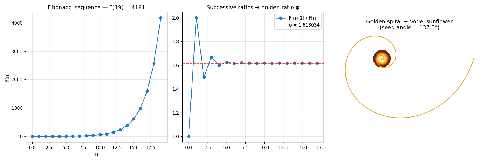 | 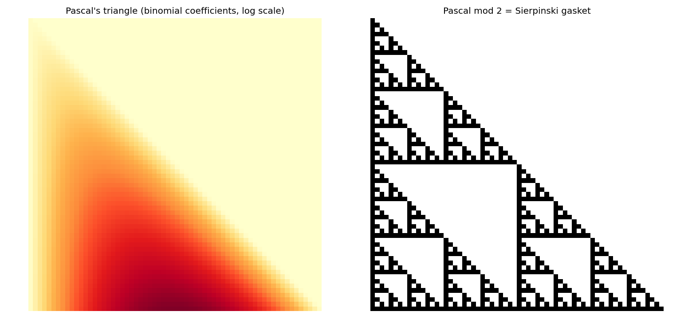 | 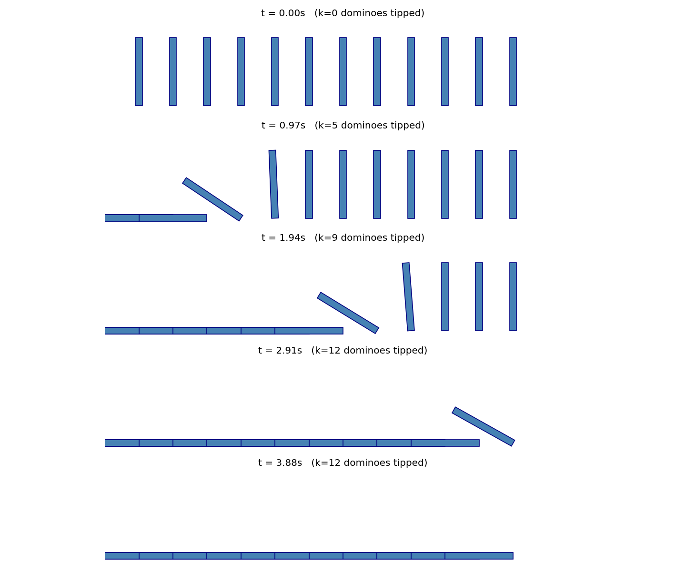 |

**🔑 关键代码片段**（`fibonacci_spiral.py`：Vogel 的向日葵种子排列，黄金角 ≈ 137.5°）

```python
# 黄金角的弧度值 —— 大自然给出的"最不可整除"角度
golden_angle = math.pi * (3 - math.sqrt(5))
k = torch.arange(1, 801, dtype=torch.float)
sun_r     = torch.sqrt(k)              # 半径 ∝ √k：每颗种子占同样面积
sun_theta = k * golden_angle           # 角度按黄金角累加
sun_x = sun_r * torch.cos(sun_theta)
sun_y = sun_r * torch.sin(sun_theta)
```

`pascal_triangle.py`：帕斯卡三角的递推 + mod 2 自动浮现谢尔宾斯基分形

```python
T = torch.zeros(N, N, dtype=torch.long); T[0, 0] = 1
for i in range(1, N):
    for j in range(i + 1):
        T[i, j] = (T[i-1, j-1] if j > 0 else 0) + (T[i-1, j] if j < i else 0)
sierpinski = (T % 2).float()           # 一行 mod 2，1654 → 20 世纪的分形
```

### Chapter 2 · 从数列到微积分：两千年的接力赛
- **核心思想**：当你**让差分的间隔无限缩小**，离散的数列就变成了连续的曲线，**导数**和**积分**就诞生了。但这个"无限缩小"的念头，是**七十多代人**前赴后继才搞清楚的。

#### 2.1 史前史：从阿基米德到中世纪（公元前 250 → 公元 1600）
微积分不是从牛顿开始的。它有一段长达 **1900 年的"前传"**：
- **阿基米德（前 287–前 212，叙拉古）**：用"穷竭法"算出球的体积是外切圆柱的 $\frac{2}{3}$ —— 这个结论刻在他的墓碑上。他在罗马士兵攻城时仍在沙地上画图，被一剑刺死前最后一句是："别动我的圆。"他实际上已经做出了**积分**的雏形，但希腊数学没有"极限"的语言，这条路被冻结了 1800 年。
- **印度喀拉拉学派（1340–1500）**：马德哈瓦（Mādhava）算出了 $\sin$、$\cos$、$\arctan$ 的**无穷级数展开** —— 比牛顿和莱布尼茨早整整 **300 年**。但他们的成果用梵文写在棕榈叶上，没有传到欧洲，一直到 19 世纪才被重新发现。**数学的进步不是必然的，它需要传播**。
- **开普勒（1609，布拉格）**：为了精确描述火星轨道（用第谷·布拉赫积累 20 年的肉眼观测数据），他**算了 70 多遍**才发现行星轨道是椭圆。在《新天文学》里，他用"无穷小三角形"算椭圆面积 —— 这是现代积分的直接前身。他也是第一个用积分**算酒桶体积**的人（1615 年的《葡萄酒桶的新立体几何》），这本书的写作动机是他觉得酒商量酒桶的方法太离谱。

#### 2.2 17 世纪的爆发：通往牛顿的五条小径（1630 → 1666）
微积分的"最后一公里"，是六个人在三十年内**几乎同时**铺好的：

| 年份 | 人物 | 贡献 | 社会背景 |
|------|------|------|---------|
| 1635 | 卡瓦列里（意） | "不可分量法"：把面积看成无数线段之和 | 伽利略学生，被教会盯着 |
| 1636 | 费马（法） | "Adequality"求极值与切线 —— 导数的雏形 | 业余数学家，本职是律师 |
| 1637 | 笛卡尔（法） | 《几何学》：解析几何，把代数和几何打通 | 在《方法论》附录里发表 |
| 1656 | 沃利斯（英） | 无穷乘积、无穷小记号 $\infty$ 由他引入 | 政治内战中破解王党密码 |
| 1670 | 巴罗（英） | 几何形式的**微积分基本定理** | 牛顿的老师，后让位给牛顿 |

到 1660 年代，导数和积分的所有零件都已经在桌面上 —— **就差一个人把它们组装起来**。

#### 2.3 牛顿的"奇迹年"与莱布尼茨的独立发现（1665 → 1684）
- **1665–1666 大瘟疫**：剑桥关闭，23 岁的牛顿回到林肯郡乡下的伍尔索普庄园，**一个人在两年里**搞出了：流数法（微积分）、万有引力、光的色散三件大事。这就是科学史上著名的 *Annus Mirabilis* —— 但他**没发表**。他的笔记本上写满了 $\dot{x}$（流数 fluxion）和 $\dot{y}$，但他怕被批评，把手稿藏了 20 年。
- **1675，巴黎**：莱布尼茨为了制造**机械计算器**（人类第一台能做四则运算的机器）正在研究无穷级数。他**完全独立地**发现了微积分，并发明了我们今天还在用的记号 $\frac{dy}{dx}$ 和 $\int$。
- **1684**：莱布尼茨抢先发表论文。
- **1687**：牛顿在哈雷的催促下出版《自然哲学的数学原理》—— 但里面**故意不用流数法**，全部翻译成古希腊式的几何证明，因为他觉得"这样更高级"。

#### 2.4 优先权大战：撕裂欧洲数学一百年（1699 → 1716）
这是科学史上最丑陋的一章：
- 1699 年起，牛顿派系（英国皇家学会）公开指控莱布尼茨**抄袭**。
- 1712 年，皇家学会成立"中立调查委员会"裁决 —— 但**报告其实是牛顿本人秘密起草的**。
- 1716 年莱布尼茨在贫困中去世，葬礼只有他的秘书一人到场。
- **代价**：英国数学家出于民族情绪坚持用牛顿的笨拙记号 $\dot{x}$，而欧陆使用莱布尼茨更优雅的 $\frac{dx}{dt}$，结果**英国数学落后了整整一个世纪**，直到 1820 年代剑桥的"分析学会"运动才追上来。

#### 2.5 严密化危机：贝克莱主教的诘问（1734 → 1872）
微积分诞生时，**它的逻辑基础其实是错的**：
- **1734，贝克莱主教（爱尔兰）**：在小册子《分析学家》中嘲讽微积分里的"无穷小量" —— "它既不是有限量、也不是零、也不是无穷小，那它到底是什么？是**逝去量的幽灵**（the ghosts of departed quantities）。"这一击让数学家头疼了 100 年。
- **1797，拉格朗日**：试图把微积分纯代数化（避开极限），失败了。
- **1821，柯西（法）**：在巴黎综合理工学院讲义中，第一次用"极限"这个概念**精确**定义导数 —— 现代分析学的开端。但他自己有时也含糊其词。
- **1860s，魏尔斯特拉斯（柏林）**：发明 $\varepsilon$-$\delta$ 语言，**真正消灭了"无穷小幽灵"**。从牛顿到魏尔斯特拉斯，**整整两百年**，微积分才有了它应有的逻辑严密性。
- **1854，黎曼**：定义现代积分。**1902，勒贝格**：测度论与勒贝格积分，把积分推广到病态函数 —— 这是后来概率论和量子力学的基础。

#### 2.6 社会土壤：为什么是 17 世纪？
微积分不是凭空诞生的。它的出现需要三个条件**同时**成熟：
1. **天文学的精度危机**：哥白尼–开普勒–伽利略积累的行星观测数据（特别是第谷的火星记录），逼着数学家必须算"瞬时速度"和"瞬时位置"。
2. **军事与航海**：弹道学（炮弹轨迹）、经度问题（航海钟）、潮汐预测 —— 都是欧洲列强重金悬赏的实际问题。
3. **印刷术 + 科学院制度**：拉丁文论文可以快速在欧洲流通，1660 年的英国皇家学会、1666 年的法国科学院给了数学家**第一个职业舞台**。

> 一句话总结：**微积分是阿基米德 + 喀拉拉学派 + 开普勒 + 费马 + 巴罗 + 牛顿 + 莱布尼茨 + 柯西 + 魏尔斯特拉斯 —— 横跨七十多代人、两千年的合作。** 我们今天写一行 `loss.backward()`，是站在这条人类思想长河的尽头。

#### 2.7 可视化与代码
- **可视化**：
  - 阿基米德 96 边形逼近圆周率 → 穷竭法的 Manim 动画
  - 开普勒 1609 年原图复现：火星椭圆轨道与"等面积定律"的无穷小三角形
  - 费马切线法（Adequality）→ 现代导数定义的演化动画
  - 牛顿《原理》第一卷命题 1：他**故意用几何**避开微积分记号的真实手稿
  - 流数 $\dot{x}$ vs 莱布尼茨 $\frac{dx}{dt}$ 的并排对照
  - 贝克莱主教的诘问可视化：当 $\Delta x \to 0$ 时究竟发生了什么？$\varepsilon$-$\delta$ 动画
  - **PyTorch 自动微分**：让学生用 `torch.autograd` 亲眼看到牛顿的"流数"在今天是如何工作的
- **代码**：`ch02_calculus/`
  - `archimedes_circle.py` —— 96 边形逼近圆周率，穷竭法可视化
  - `madhava_pi_series.py` —— 喀拉拉学派的 $\pi$ 级数（比 Leibniz 公式早 300 年）
  - `kepler_wine_barrel.py` —— 开普勒用无穷小算酒桶体积
  - `fermat_tangent.py` —— 费马的 Adequality 求切线
  - `newton_orbit.py` —— 数值积分模拟开普勒椭圆轨道
  - `berkeley_ghost.py` —— "逝去量的幽灵" → $\varepsilon$-$\delta$ 极限可视化
  - `autograd_as_fluxion.py` —— 把 `loss.backward()` 翻译成牛顿语言

**🖼️ 输出可视化**

| 阿基米德 96 边形逼近 π | 牛顿椭圆轨道数值积分 | 牛顿流数 = PyTorch autograd |
|:---:|:---:|:---:|
| 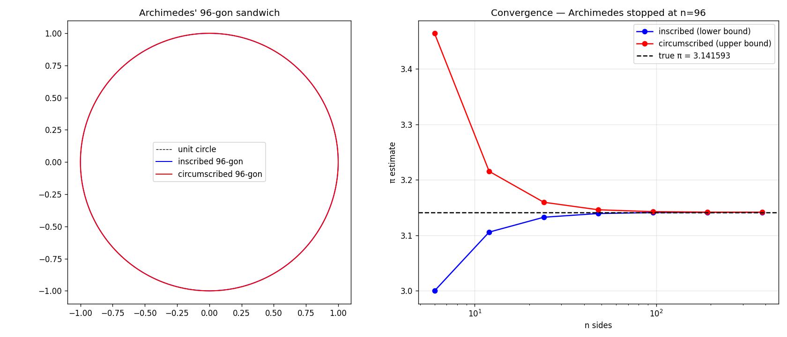 | 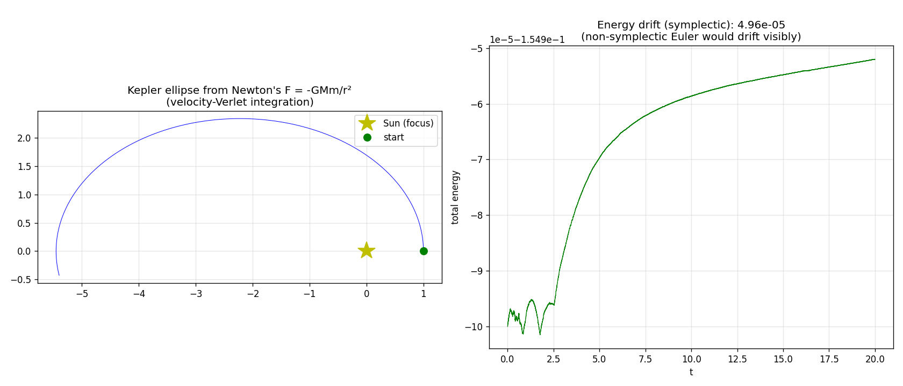 | 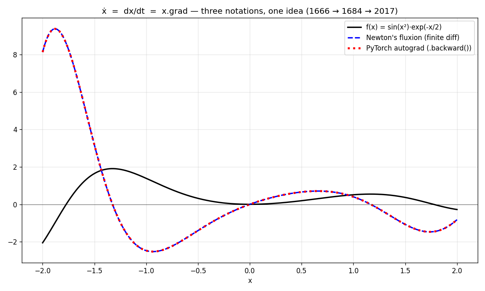 |

**🔑 关键代码片段**（`autograd_as_fluxion.py` —— 整个项目的"题眼"：牛顿 1666 写下的 ẋ，就是今天的 `x.grad`）

```python
def f_of(x):
    return torch.sin(x**2) * torch.exp(-x / 2)

# 牛顿的"流数" —— 中心差分（他当年也是这么数值算的）
h = 1e-4
fluxion_newton = (f_of(x_grid + h) - f_of(x_grid - h)) / (2 * h)

# PyTorch autograd —— 反向模式自动微分
x = x_grid.clone().requires_grad_(True)
y = f_of(x)
y.sum().backward()                       # 莱布尼茨链式法则的自动化
fluxion_autograd = x.grad

# 1666 牛顿  ==  1684 莱布尼茨  ==  2017 PyTorch
assert (fluxion_newton - fluxion_autograd).abs().max() < 1e-3
```

### Chapter 3 · 高次方程的悲剧与代数的诞生
- **历史人物**：花拉子米（820，"代数"一词的来源）、卡尔达诺（1545）、阿贝尔（1824，27 岁病逝）、伽罗瓦（1832，21 岁决斗死）
- **核心思想**：二次方程很简单，三次四次还有公式，但**五次方程没有根式解** —— 这不是技术问题，而是**对称性的本质限制**。
- **可视化**：
  - 二次方程求根 → 配方法的几何意义（正方形面积）
  - 卡尔达诺三次方程公式的动画推导
  - **核心高潮**：用 PyTorch 在复平面上画出五次方程的根，演示**根的对称群** $S_5$ 为什么不可解
  - 伽罗瓦群的可视化：根的置换如何形成群结构
- **代码**：`ch03_polynomials/`
  - `cardano_cubic.py` —— 三次方程的几何与代数解法
  - `quintic_roots_complex.py` —— 五次方程根在复平面的舞蹈
  - `galois_group_viz.py` —— $S_5$ 群的 Cayley 图

**🖼️ 输出可视化**

| 卡尔达诺三次方程 | 五次方程根的复平面 | 伽罗瓦 S₅ 群结构 |
|:---:|:---:|:---:|
| 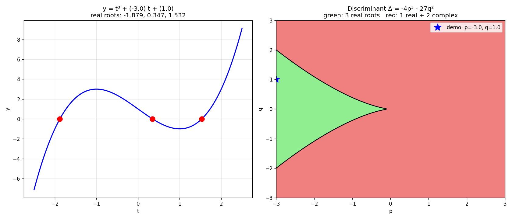 | 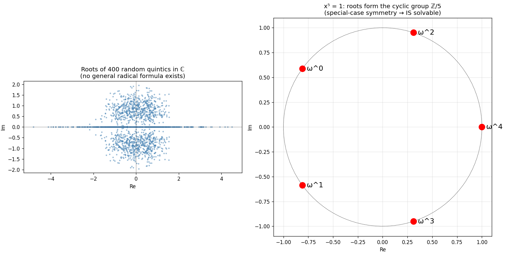 | 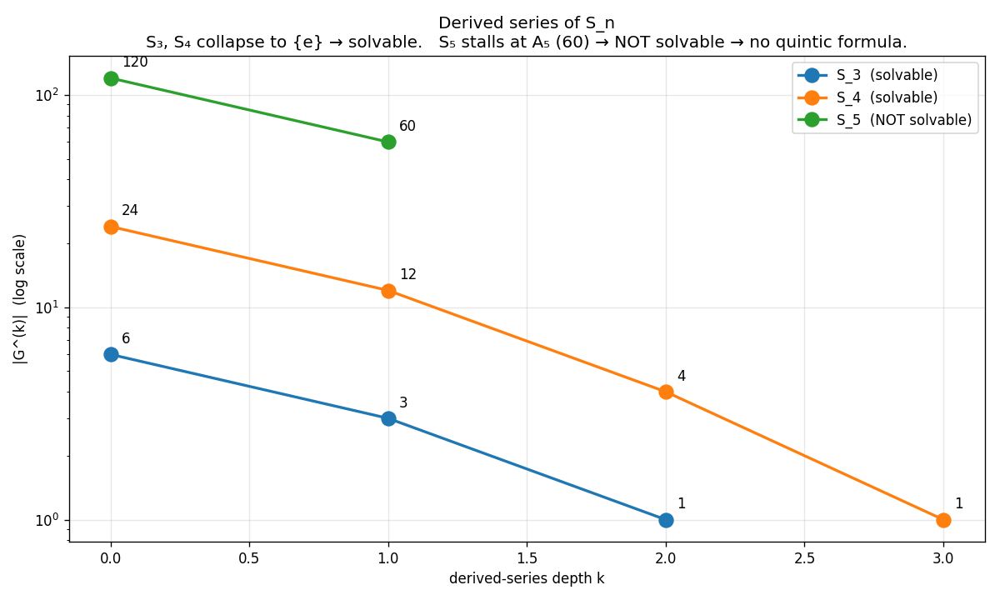 |

**🔑 关键代码片段**（`quintic_roots_complex.py` —— 阿贝尔–鲁菲尼定理：五次方程没有"求根公式"，但根本身存在）

```python
# 400 个随机五次方程，全部用数值法求根 —— "存在 ≠ 可写成根式"
M = 400
coeffs = torch.randn(M, 5) * 1.5
all_roots = []
for c in coeffs:
    poly = [1.0] + c.tolist()
    all_roots.append(np.roots(poly))   # 数值上一定能找到 5 个根

# 特殊情形 x⁵ = 1 —— 循环群 ℤ/5，是可解的
roots_unity = np.roots([1, 0, 0, 0, 0, -1])   # 单位圆上 5 个等距点
```

### Chapter 4 · 线性代数：从《九章算术》到矩阵宇宙
- **核心思想**：当未知数从 2 个变成 100 个，"消元法"必须被**系统化** —— 矩阵不是高中老师说的"一堆数字"，而是**线性变换的语言**。但从"解方程组"到"矩阵作为代数对象"，人类走了 **2000 年**。

#### 4.1 古代：解方程组的实用智慧（前 200 → 公元 1000）
线性代数的源头不在欧洲，而在**东方**：
- **《九章算术·方程章》（约公元前 200 → 公元 263 刘徽注）**：第八章"方程"中明确给出了**五元一次方程组**的解法，使用"遍乘直除"算法 —— 这就是**高斯消元法**的完整原型，**比高斯早了整整 1500 年**。原文："今有上禾三秉，中禾二秉，下禾一秉，实三十九斗……"（这是一道土地分粮问题）。刘徽（263）作注时已经在用**负数**做消元，比欧洲早 1300 年（欧洲数学家在 16 世纪还把负数叫"荒谬数"）。
- **印度：婆罗摩笈多（628）、巴斯卡拉（1150）**：用一种叫 *kuṭṭaka*（"粉碎法"）的算法解线性丢番图方程 —— 服务于天文学（行星会合周期计算）。
- **波斯/阿拉伯：花拉子米（820）**：《代数学》（*al-Jabr*）系统化了一次和二次方程的解法 —— "代数"（algebra）这个词就来源于此。

#### 4.2 行列式的诞生：东西方独立发明（1683 → 1812）
"行列式"这个概念，在地球两端**几乎同时**被发明：
- **1683，关孝和（日本）**：在《解伏题之法》中给出了 **3 阶到 5 阶**行列式的展开公式 —— **比莱布尼茨早 10 年**。江户时代的"和算"流派由此达到巅峰。
- **1693，莱布尼茨**：在给洛必达的信里独立提出了行列式的概念，但没有发表。
- **1750，克莱姆（瑞士）**：发表"克莱姆法则" —— 用行列式解线性方程组的公式。
- **1772，范德蒙德（法）**：第一次把行列式作为**独立的研究对象**（不只是解方程的工具）。
- **1812，柯西**：把"determinant"（决定式）这个名字定下来，证明了行列式乘法定理。

#### 4.3 高斯与失踪的小行星：最小二乘法的真实故事（1801）
线性代数史上最戏剧性的一章：
- **1801 年 1 月 1 日**：意大利天文学家皮亚齐发现了第一颗小行星**谷神星**（Ceres），观测了 41 天后，谷神星运行到太阳背后**消失了**。整个欧洲天文界陷入恐慌：人类历史上第一颗发现的小行星，**就这样丢了**。
- **1801 年下半年**：24 岁的高斯接受挑战。他用一种当时还没公开的方法 —— **最小二乘法**（least squares）—— 从 41 天的稀疏观测数据反推轨道。
- **1801 年 12 月 31 日**：根据高斯预测的位置，天文学家**重新找到了谷神星**，误差极小。这一战让高斯名震欧洲。
- **1809**：高斯在《天体运动论》中公开最小二乘法。**勒让德 1805 年其实已经独立发表了这个方法**，于是又是一场（比较温和的）优先权之争。
- 最小二乘法的本质就是 $A^T A x = A^T b$ —— 这是今天**所有机器学习"训练"的最古老祖先**。

#### 4.4 矩阵作为代数对象：英国学派的发明（1850 → 1890）
"矩阵"这个词出现得很晚：
- **1850，西尔维斯特（英）**：第一次使用 "matrix"（矩阵）这个词 —— 拉丁语原意是"母体、子宫"，因为他认为矩阵是"生出行列式的母体"。
- **1858，凯莱**："A Memoir on the Theory of Matrices" —— 第一篇把**矩阵视为独立代数对象**的论文。定义了矩阵加法、乘法、逆矩阵、**凯莱-哈密顿定理**（每个矩阵满足自己的特征多项式）。
- **1878，弗罗贝尼乌斯（德）**：秩、相似变换、Jordan 标准形 —— 矩阵理论体系化。
- **社会背景**：19 世纪是**电报网络、铁路调度、保险精算**爆炸的时代，工程师需要系统化的方法处理大型线性方程组。

#### 4.5 向量空间的抽象化（1843 → 1888）
和矩阵平行，"向量"也在被发明：
- **1843，哈密顿（爱尔兰）**：在都柏林布鲁姆桥散步时，**当场刻在桥栏杆上**：$i^2 = j^2 = k^2 = ijk = -1$ —— 四元数诞生。"vector"（向量）一词由他引入。
- **1844，格拉斯曼（德，中学教师）**：《延伸论》（*Ausdehnungslehre*），独立建立了 $n$ 维向量空间和外代数 —— **完全超越他的时代**，被同行无视，他后来转去研究梵语，成了著名的语言学家。**直到 1880 年代他的数学才被重新发现**。
- **1880s，吉布斯 & 亥维赛**：从四元数中提炼出现代的向量分析（点积、叉积、$\nabla$ 算子）—— 麦克斯韦方程组的标准语言。
- **1888，皮亚诺**：第一次给出**抽象向量空间的公理化定义** —— 这是现代线性代数的起点。

#### 4.6 无穷维与量子革命（1900 → 1932）
线性代数走出"有限维"，迎来 20 世纪最壮丽的应用：
- **1900–1910，希尔伯特**：研究积分方程时引入"希尔伯特空间"—— 无穷维的内积空间。
- **1922，巴拿赫（波兰）**：泛函分析诞生，巴拿赫空间。
- **1925，海森堡**：在赫尔戈兰岛养花粉过敏，**重新发明了矩阵乘法**（他当时不知道矩阵是什么），写下"矩阵力学"。
- **1926，薛定谔**：波动力学（看似不同的另一种语言）。
- **1932，冯·诺伊曼**：《量子力学的数学基础》—— 证明矩阵力学和波动力学**本质上是同一个希尔伯特空间上的算子理论**。**线性代数在这一刻成为物理学的官方语言**。

#### 4.7 计算线性代数：从打孔卡到 GPU（1947 → 现在）
现代深度学习背后是一条隐秘的计算技术线：
- **1947，图灵**：分析数值线性方程组求解的舍入误差 —— 数值线性代数的开端。
- **1950s，Householder、Givens**：正交变换、QR 分解 —— 数值稳定的算法。
- **1965，Cooley-Tukey**：FFT 算法（快速傅里叶变换）—— 实质上是一个矩阵分解。
- **1979，LINPACK** → **1992，LAPACK** → **BLAS**：今天 NumPy / PyTorch / TensorFlow **底层调用的还是这些 1990 年代写的 Fortran 代码**。
- **2007，CUDA**：GPU 上的矩阵乘法 —— 深度学习革命的硬件基础。

> 一句话总结：**当你写下 `torch.matmul(A, B)` 时，你正在调用从《九章算术》刘徽、关孝和、高斯找谷神星、凯莱定义矩阵、海森堡的量子力学、到 1990 年代 LAPACK 工程师 —— 跨越 2200 年的智识遗产。**

#### 4.8 可视化与代码
- **可视化**：
  - 《九章算术·方程章》原文影印 → 用 PyTorch 复现"遍乘直除"算法 → 与现代高斯消元对比
  - 关孝和的 5 阶行列式手稿 → Manim 动画展开
  - **谷神星寻回**：用最小二乘法从 41 天稀疏观测预测轨道（重现 1801 年的高斯）
  - 矩阵 = 空间变换：旋转、缩放、剪切的动画（致敬 3Blue1Brown）
  - 特征值 = "变换中不动的方向" —— PageRank、主成分分析的几何直觉
  - 哈密顿四元数 → 3D 旋转可视化（游戏引擎和航天器姿态控制都在用）
  - **PyTorch 实战**：用 SVD 做图像压缩，让学生看到线性代数如何**直接变成 JPEG 和深度学习的底层**
- **代码**：`ch04_linear_algebra/`
  - `jiuzhang_elimination.py` —— 复刻《九章算术》方程章的"遍乘直除"
  - `seki_determinant.py` —— 关孝和 1683 年的行列式展开
  - `gauss_ceres.py` —— 用最小二乘法找回谷神星
  - `matrix_as_transform.py` —— 矩阵变换的可视化
  - `hamilton_quaternion.py` —— 四元数与 3D 旋转
  - `heisenberg_matrix.py` —— 矩阵力学求解氢原子能级
  - `svd_image_compression.py` —— 用 SVD 压缩蒙娜丽莎

**🖼️ 输出可视化**

| 高斯消元法（《九章算术》遗产） | 矩阵 = 空间变换 |
|:---:|:---:|
| 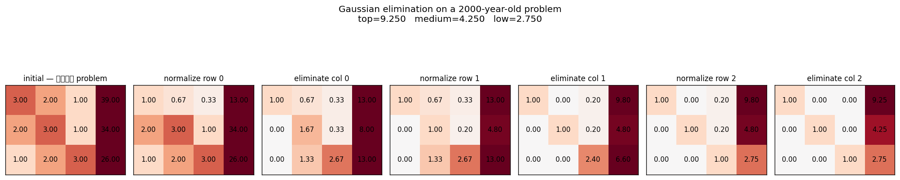 | 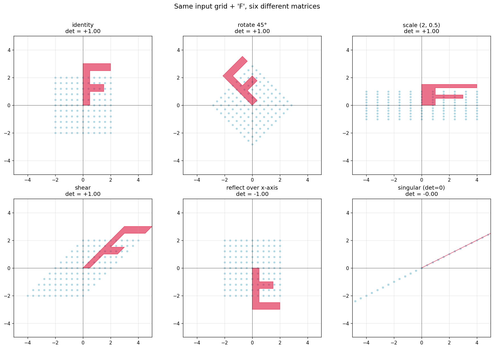 |

| SVD 图像压缩（k = 1, 5, 20, 50, 200, full） | 奇异值谱（自然图像的能量集中现象） |
|:---:|:---:|
| 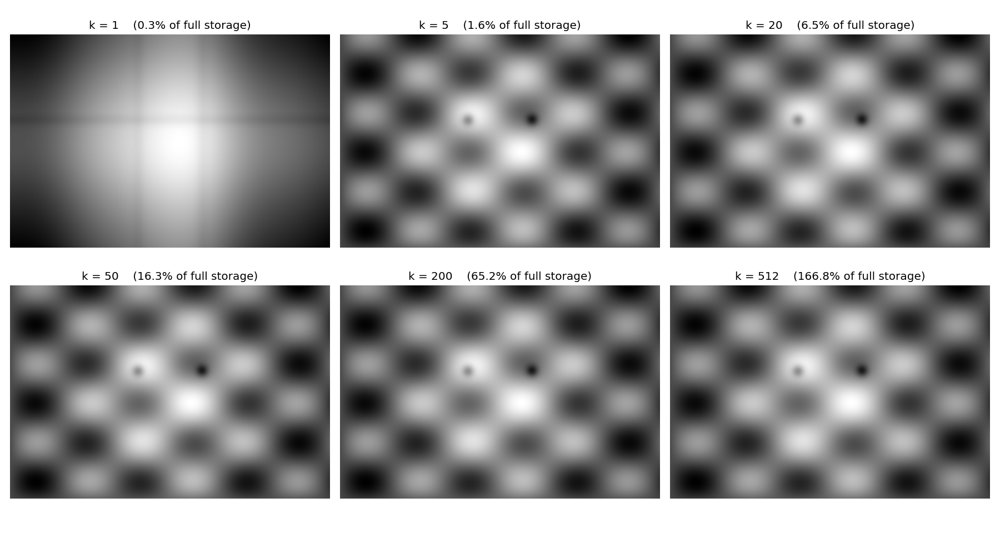 | 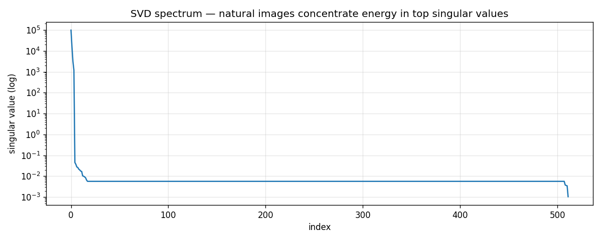 |

**🔑 关键代码片段**（`svd_image_compression.py` —— Eckart-Young 定理（1936）：保留前 k 个奇异值就是 Frobenius 范数下最佳的低秩逼近，**JPEG / PCA / Transformer 注意力机制**共同的祖先）

```python
A = torch.from_numpy(img).float()                # 灰度图当矩阵
U, S, Vh = torch.linalg.svd(A, full_matrices=False)

for k in [1, 5, 20, 50, 200, len(S)]:
    Ak = U[:, :k] @ torch.diag(S[:k]) @ Vh[:k]   # 秩-k 重建
    # 存储 Ak 只需 k·(H + W + 1) 个数，而原图是 H·W
```

### Chapter 5 · 工业革命与傅里叶：数学如何驱动机器
- **历史人物**：傅里叶（1807，研究蒸汽机散热）、麦克斯韦（1865，电磁方程）、希尔伯特（1900，无穷维空间）
- **核心思想**：任何复杂的周期信号，都可以分解成**正弦波的叠加** —— 这是 MP3、JPEG、Wi-Fi、CT 扫描的共同基础。
- **可视化**：
  - 蒸汽机金属杆的热传导仿真（PyTorch 求解偏微分方程）
  - 方波 → 正弦波叠加的经典 Gibbs 现象动画
  - 用 FFT 给一段音乐"看体检报告"：频谱图
- **代码**：`ch05_fourier/`
  - `heat_equation.py` —— 1D 热传导方程的有限差分仿真
  - `fourier_square_wave.py` —— 方波的傅里叶级数逼近
  - `audio_spectrogram.py` —— 实时音频频谱可视化

**🖼️ 输出可视化**

| 1D 热传导方程（傅里叶 1807 的原问题） | 方波 = 奇次谐波之和（吉布斯现象） | 音频频谱图（FFT 给音乐"做体检"） |
|:---:|:---:|:---:|
| 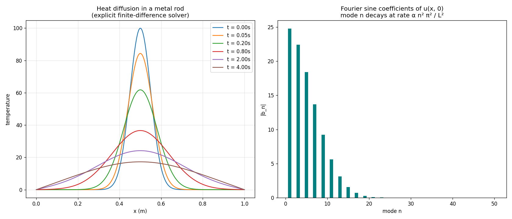 | 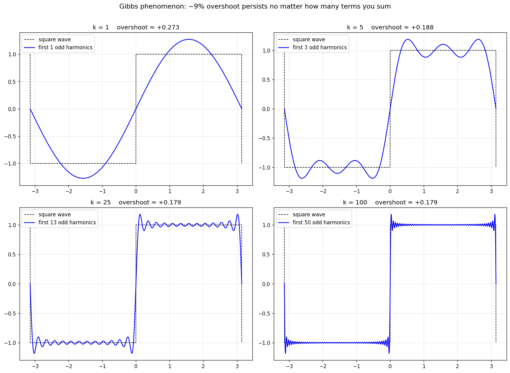 | 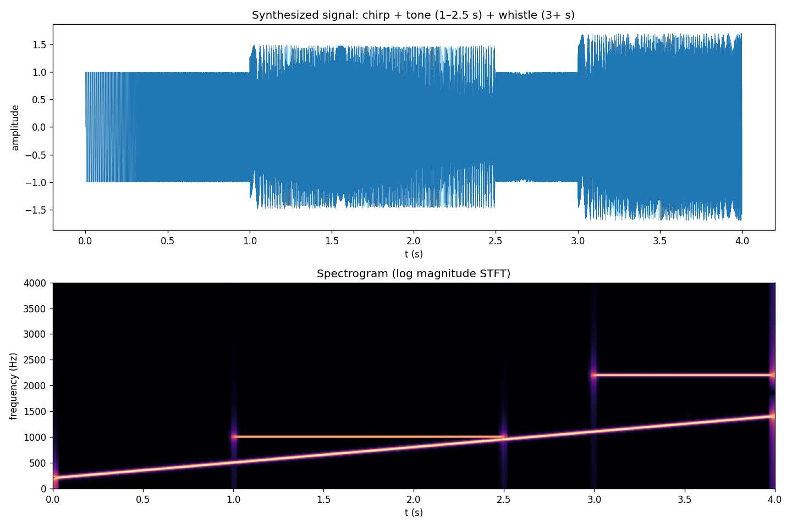 |

**🔑 关键代码片段**（`fourier_square_wave.py` —— 任何方波都能写成 sin(x) + sin(3x)/3 + sin(5x)/5 + ...，但永远残留约 9% 的"吉布斯 overshoot"）

```python
x = torch.linspace(-math.pi, math.pi, 2000)
target = torch.sign(torch.sin(x))                # 方波

# 傅里叶级数：只用奇次谐波
n = torch.arange(1, k + 1, dtype=torch.float)
odd = n[n % 2 == 1]
approx = torch.zeros_like(x)
for m in odd:
    approx = approx + torch.sin(m * x) / m
approx = approx * 4 / math.pi                    # k → ∞ 时趋向方波，但 overshoot 不消失
```

### Chapter 6 · 概率与统计：从赌桌到 AI
- **历史人物**：帕斯卡 & 费马（1654，赌徒分钱问题）、贝叶斯（1763）、高斯（1809，正态分布）、玻尔兹曼（1877，熵）
- **核心思想**：概率论起源于**赌徒**，长成了**保险、量子力学、机器学习**的支柱。
- **代码**：`ch06_probability/`
  - `pascal_fermat_dice.py` —— 赌博分钱问题的蒙特卡洛仿真
  - `bayes_disease_test.py` —— 贝叶斯定理的医学诊断悖论
  - `mle_vs_map.py` —— 用 PyTorch 实现极大似然与最大后验

**🖼️ 输出可视化**

| 帕斯卡–费马的赌徒分钱（蒙特卡洛） | 贝叶斯检验悖论：99% 准确 ≠ 99% 患病 | 极大似然 vs 最大后验 |
|:---:|:---:|:---:|
| 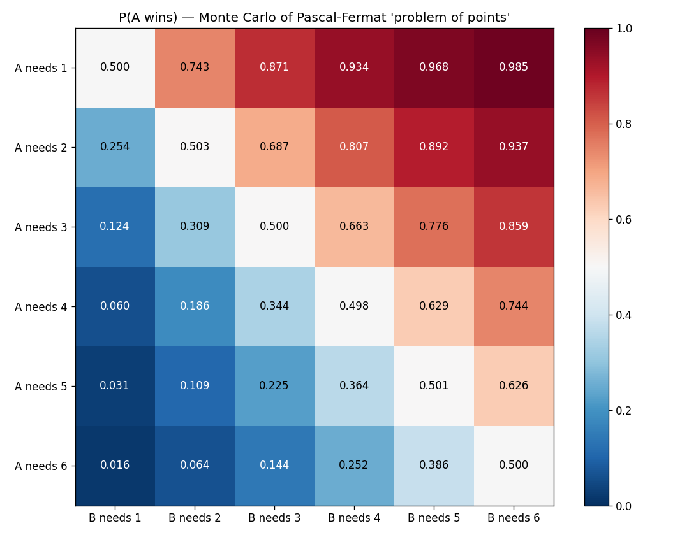 | 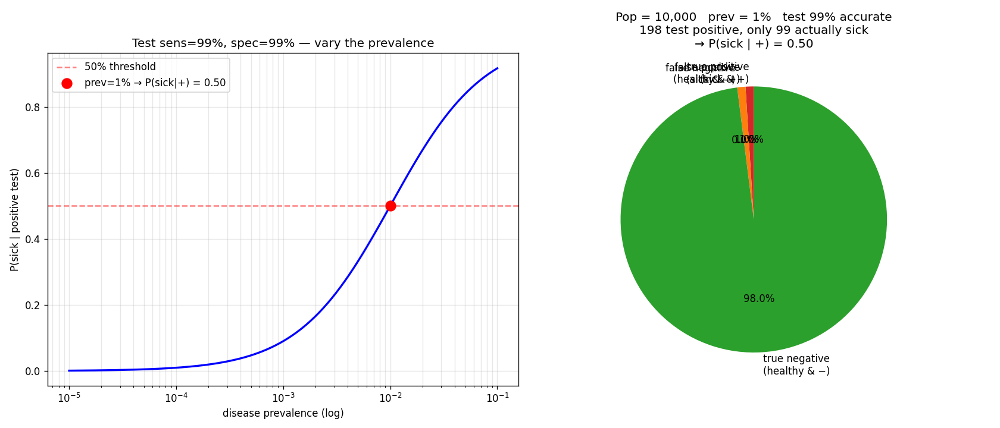 | 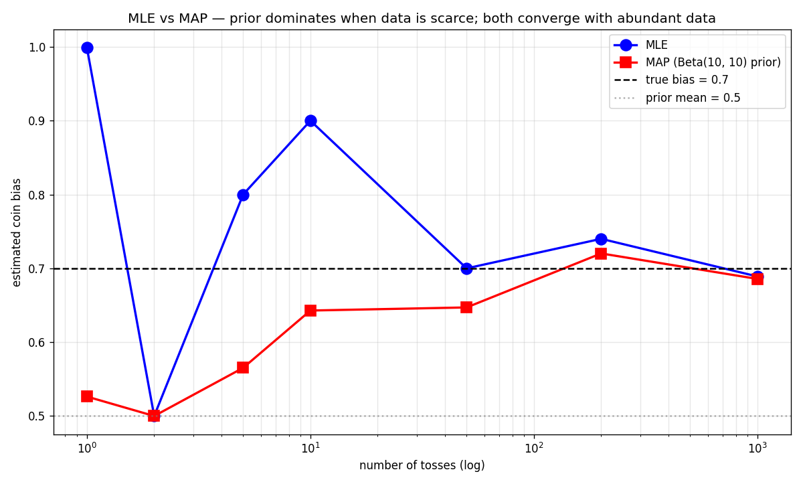 |

**🔑 关键代码片段**（`bayes_disease_test.py` —— 99% 准确度的检验，对 1% 患病率的人群依然只有 ~50% 后验概率，这就是基率忽略）

```python
sens = 0.99   # P(阳性 | 患病)
spec = 0.99   # P(阴性 | 健康)

# 贝叶斯公式：P(患病|阳性) = sens·prev / (sens·prev + (1-spec)·(1-prev))
prevalences = torch.logspace(-5, -1, 200)
posterior = (sens * prevalences) / (
    sens * prevalences + (1 - spec) * (1 - prevalences)
)
# 当 prev = 1% 时，后验 ≈ 0.50 —— 一半的"阳性"其实是健康人
```

### Chapter 7 · 现代深度学习：站在所有巨人的肩膀上
- **核心思想**：当我们写下 `loss.backward()` 时，我们在同时使用：
  - 牛顿的**微积分**（求导）
  - 高斯的**线性代数**（矩阵乘法）
  - 拉格朗日的**最优化**（梯度下降）
  - 傅里叶的**频域分析**（卷积神经网络）
  - 贝叶斯的**概率论**（softmax / KL 散度）
- 这一章把前面 6 章串起来，让学生**真正理解**：为什么深度学习不是"炼丹"，而是**三百年数学史的集大成者**。
- **代码**：`ch07_deep_learning/`
  - `mnist_from_scratch.py` —— 用纯 PyTorch 训练 MNIST，每一行都标注"这一步对应历史上谁的工作"

**🖼️ 输出可视化**

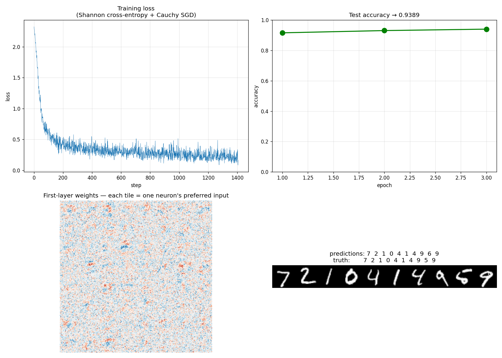

> 训练损失（Shannon 交叉熵 + Cauchy SGD）· 测试准确率 · 第一层权重（每个格子 = 一个神经元偏好的输入模式）· 模型预测 vs 真实标签

**🔑 关键代码片段**（`mnist_from_scratch.py` —— 训练循环的 6 行代码，是 6 位历史人物的合作）

```python
# Cayley (1858)：一个全连接层 = 矩阵乘 + 偏置
W1 = (torch.randn(784, 128) * 0.05).requires_grad_(True)
b1 = torch.zeros(128, requires_grad=True)
W2 = (torch.randn(128, 10) * 0.05).requires_grad_(True)
b2 = torch.zeros(10, requires_grad=True)

def model(x):
    h = F.relu(x.view(x.shape[0], -1) @ W1 + b1)   # Cayley + Hahnloser (2000)
    return h @ W2 + b2

opt = torch.optim.SGD([W1, b1, W2, b2], lr=0.1)    # Cauchy 1847 + Robbins-Monro 1951

for x, y in train_loader:
    loss = F.cross_entropy(model(x), y)            # Boltzmann 熵 + Shannon 信息论
    opt.zero_grad()
    loss.backward()                                # Leibniz 链式法则，Rumelhart 1986 自动化
    opt.step()                                     # 牛顿流数 → x.grad
```

> **一行 `loss.backward()` 的背后**：牛顿（微分）+ 高斯（线性代数）+ 柯西（梯度下降）+ 玻尔兹曼（熵）+ 香农（交叉熵）+ 莱布尼茨（链式法则）—— **三百年数学史在 0.001 秒里同时复活。**

---

## 🛠️ 技术栈

| 用途 | 工具 |
|------|------|
| 数值计算与自动微分 | `PyTorch` |
| 静态数学绘图 | `Matplotlib`, `Seaborn` |
| 数学动画（致敬 3Blue1Brown） | `Manim Community Edition` |
| 交互式探索 | `Jupyter Notebook`, `Streamlit` |
| 符号计算（验证手推） | `SymPy` |
| 历史文档 OCR / 原始资料 | `tesseract`, archive.org |

---

## 📦 安装

```bash
git clone https://github.com/<your-name>/math-history-viz.git
cd math-history-viz
python -m venv .venv && source .venv/bin/activate
pip install -r requirements.txt

# 运行第一章的斐波那契螺线
python ch01_sequences/fibonacci_spiral.py
```

---

## 📚 推荐阅读（每一章的"原始资料"）

- 《古今数学思想》—— Morris Kline（必读，本项目精神源头）
- 《数学：确定性的丧失》—— Morris Kline
- 《无言的宇宙》—— Dana Mackenzie（24 个改变历史的方程）
- 《e 的故事》《虚数的故事》《不可能的几何挑战》—— Eli Maor 系列
- 《Men of Mathematics》—— E.T. Bell（数学家传记，1937 年经典）
- 牛顿《自然哲学的数学原理》（中译本，商务印书馆）
- 伽罗瓦的最后信件原稿（archive.org 有扫描件）

---

## 🌱 项目哲学

> "Those who cannot remember the past are condemned to repeat it." — Santayana
>
> 不知道一个公式从哪里来的人，注定只能机械地使用它，并最终遗忘它。

我们不反对应试，但我们反对**只有应试**。
我们不反对公式，但我们反对**只背公式**。
我们相信：**当一个 16 岁的中学生知道伽罗瓦在决斗前夜写下群论的那一刻，他对数学的态度会永远改变。**

如果这个项目能让哪怕一个学生抬起头说："原来数学是这样的，我想再多学一点" ——
它就值得存在。

---

## 🤝 贡献

欢迎提 Issue / PR：
- 补充更多历史人物和故事
- 增加新的可视化（特别欢迎 Manim 动画）
- 翻译成英文 / 日文 / 法文
- 错误修正与代码优化

License: MIT
